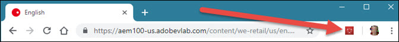

# Installera Adobe Experience Cloud Debugger{#install-experience-cloud-debugger}

Hämta och installera Adobe Experience Cloud Debugger-tillägget för Chrome från [Chrome-tilläggssidan](https://chrome.google.com/webstore/detail/adobe-experience-cloud-de/ocdmogmohccmeicdhlhhgepeaijenapj).

När du har installerat tillägget läggs en ikon till i fältet för Chrome-tillägg:

>[!VIDEO](https://video.tv.adobe.com/v/23114t2/)
