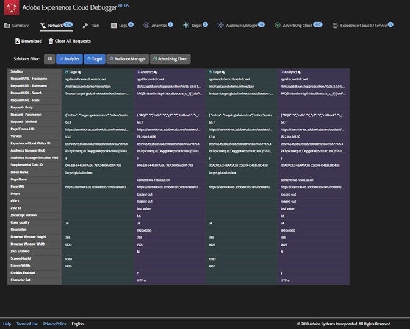

# Nätverksinformation{#network-information}

Om du vill visa nätverksinformation klickar du på **[!UICONTROL Network]**.

På nätverksskärmen samlas alla samtal om Adobe Experience Cloud-lösningar som gjorts på sidan och visas i ordning från vänster till höger. Standardparametrar etiketteras automatiskt med egna namn och ordnas för att gruppera gemensamma parametrar i samma roll.

>[!TIP]
>
>Den här skärmen är användbar för att bekräfta att de parametrar som används för integreringar, som Experience Cloud Visitor ID eller Kompletterande data-ID, är konsekventa för alla integreringar.

>[!NOTE]
>
>I nuläget visas inte alla parametrar som skickas i lösningsanrop (till exempel kontextvariabler för Analytics, anpassade målparametrar eller kundens ID:n för Experience Cloud ID-tjänst) på nätverksskärmen.

Om du vill visa all information väljer du **[!UICONTROL All]**.

Du kan också filtrera informationen per lösning. Välj de lösningar du vill visa. Du kan visa flera lösningar samtidigt. De valda lösningsfiltren markeras.

Klicka på ett objekt i nätverksvyn för att se det större. I det utökade visningsfönstret kan du kopiera den information som visas till Urklipp.

Använd ikonen längst upp i varje kolumn för att kopiera serveranropets URL till Urklipp, där du kan klistra in den i ett annat dokument för referens- eller felsökningsändamål.

