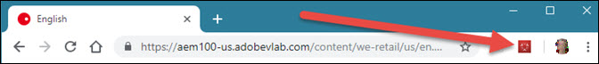

# Sammanfattningsskärm{#summary-screen}

Om du vill köra Adobe Experience Cloud Debugger klickar du på tilläggsikonen i tilläggsfältet och öppnar sedan sidan som du vill granska i Chrome.

Skärmen Sammanfattning för Experience Cloud Debugger visas.

På den här skärmen visas en miniatyrbild av sidan samt sidans URL och rubrik. Här finns också information om de olika Adobe Experience Cloud-lösningarna. Den information som visas varierar beroende på lösning, men omfattar vanligtvis information som lösningsbiblioteket och version (till exempel&quot;AppMeasurement v2.9&quot;) och kontoidentifierare (till exempel Analytics-rapportens programpaket-ID, målklientkoden, Audience Manager partner-ID osv.)

Siffrorna i blått bredvid flikarna högst upp i fönstret visar antalet serveranrop som har gjorts. Du kan återställa dessa till noll genom att klicka på **[!UICONTROL Clear All Requests]** på respektive flik.

I följande bild visas information om Adobe Target. Observera att om du vill visa aktivitetsinformationen som visas nedan utan autentisering måste du implementera felsökningshändelseavlyssnaren i koden eller tagghanteraren och aktivera de nödvändiga [svarstoken](https://docs.adobe.com/content/help/en/target/using/administer/response-tokens.html) i målgränssnittet.

## Kör en granskning i Adobe Experience Platform Auditor {#section-82bc57440406461ebf27a16855b71655}

Du kan använda verktyget Spela upp granskare för att köra en serie granskningar på sidan. Om du vill köra plattformsgranskaren klickar du på **[!UICONTROL Auditor]** på den översta menyn och sedan på **[!UICONTROL Audit Page Now]**. Klicka på **[!UICONTROL Run Multi-Page Audit Now]** om du vill öppna plattformsgranskaren.

## Information som visas i Experience Cloud Debugger {#section-88a95ba53dca43d9b96a585e75e5f5cf}

Experience Cloud Debugger visar följande information för varje lösning:

**Sidinformation**

<table id="table_FF3B9083524244D29AF350978A0AC236"> 
 <tbody> 
  <tr> 
   <td colname="col1"> 
Sidskärmbild 
 </td> 
   <td colname="col2"> 
Miniatyrbild av sidan 
 </td> 
  </tr> 
  <tr> 
   <td colname="col1"> 
URL 
 </td> 
   <td colname="col2"> 
URL för sidan 
 </td> 
  </tr> 
  <tr> 
   <td colname="col1"> 
Titel 
 </td> 
   <td colname="col2"> 
Namnet som anges i  &lt;TITLE&gt;-taggen 
 </td> 
  </tr> 
 </tbody> 
</table>

**Adobe Analytics**

<table id="table_BEB9CC58E59D4D86BC895A8A51D84A2C"> 
 <tbody> 
  <tr> 
   <td colname="col1"> 
Rapportsvit(er) 
 </td> 
   <td colname="col2"> 
I <a href="https://docs.adobe.com/content/help/en/analytics/admin/manage-report-suites/report-suites-admin.html" format="html" scope="external">-rapportsviten</a> definieras den fullständiga, oberoende rapporteringen på en vald webbplats, uppsättning webbplatser eller delmängd av webbsidor 
 </td> 
  </tr> 
  <tr> 
   <td colname="col1"> 
Version 
 </td> 
   <td colname="col2"> 
Versionen <a href="https://docs.adobe.com/content/help/en/analytics/implementation/js/overview.html" format="html" scope="external"> AppMeasurement</a> som har definierats för sidan 
 </td> 
  </tr> 
  <tr> 
   <td colname="col1"> 
Besökarversion 
 </td> 
   <td colname="col2"> 
Versionen för <a href="https://docs.adobe.com/content/help/en/analytics/technotes/visitor-identification.html" format="html" scope="external"> besökar-ID</a>-biblioteket. 
 </td> 
  </tr> 
  <tr> 
   <td colname="col1"> 
Sidnamn 
 </td> 
   <td colname="col2"> 
Variabeln <a href="https://docs.adobe.com/content/help/en/analytics/implementation/vars/page-vars/page-variables.html" format="html" scope="external"> pageName</a> har skickats till Analytics som innehåller ett användarvänligt namn för webbplatsen. 
 </td> 
  </tr> 
  <tr> 
   <td colname="col1"> 
Moduler 
 </td> 
   <td colname="col2"> 
Modulerna som läses in av Adobe Analytics 
 </td> 
  </tr> 
 </tbody> 
</table>

**Audience Manager**

<table id="table_784AEABADBDA4D14BB9A7A9CB9EF07C3"> 
 <tbody> 
  <tr> 
   <td colname="col1"> 
Partner 
 </td> 
   <td colname="col2"> 
<a href="https://docs.adobe.com/content/help/en/audience-manager/user-guide/dil-api/dil-instance-methods.html#getpartner" format="html" scope="external">-partnernamnet</a> för DIL-instansen 
 </td> 
  </tr> 
  <tr> 
   <td colname="col1"> 
Version 
 </td> 
   <td colname="col2"> 
Versionsnumret för instansen DIL 
 </td> 
  </tr> 
  <tr> 
   <td colname="col1"> 
UUID 
 </td> 
   <td colname="col2"> 
Det unika användar-ID <a href="https://docs.adobe.com/content/help/en/audience-manager/user-guide/reference/ids-in-aam.html" format="html" scope="external"> som är associerat med DIL-instansen</a> 
 </td> 
  </tr> 
 </tbody> 
</table>

**Adobe Experience Platform Launch**

<table id="table_E9574975444A407887E26514D1BB1601"> 
 <tbody> 
  <tr> 
   <td colname="col1"> 
Namn 
 </td> 
   <td colname="col2"> 
Namnet på Platforma launchen <a href="https://docs.adobe.com/content/help/en/launch/using/reference/admin/companies-and-properties.html" format="https" scope="external"> egenskap</a> 
 </td> 
  </tr> 
  <tr> 
   <td colname="col1"> 
Version 
 </td> 
   <td colname="col2"> 
Versionen av <a href="https://developer.adobelaunch.com/extensions/reference/turbine-free-variable/" format="https" scope="external"> turbin</a> 
 </td> 
  </tr> 
  <tr> 
   <td colname="col1"> 
Skapad den 
 </td> 
   <td colname="col2"> 
Platforma launchen <a href="https://docs.adobe.com/content/help/en/launch/using/reference/publish/libraries.html" format="https" scope="external"> bibliotek</a> byggdatum 
 </td> 
  </tr> 
  <tr> 
   <td colname="col1"> 
Miljö 
 </td> 
   <td colname="col2"> 
Miljön  som används av Platforma launchen bibliotek 
 </td> 
  </tr> 
  <tr> 
   <td colname="col1"> 
Skriptkatalog 
 </td> 
   <td colname="col2"> 
Katalogen där Platforma launchen lagras 
 </td> 
  </tr> 
 </tbody> 
</table>

**Adobe DTM**

<table id="table_DC76D63FA6EF4891906B9E1D3E4A8A6C"> 
 <tbody> 
  <tr> 
   <td colname="col1"> 
Biblioteksnamn 
 </td> 
   <td colname="col2"> 
Namnet på Adobe DTM<a href="https://docs.adobe.com/content/help/en/dtm/using/library-management.html" format="html" scope="external">-biblioteket</a> 
 </td> 
  </tr> 
  <tr> 
   <td colname="col1"> 
Version 
 </td> 
   <td colname="col2"> 
Turbinversionen 
 </td> 
  </tr> 
  <tr> 
   <td colname="col1"> 
Skapad den 
 </td> 
   <td colname="col2"> 
Platforma launchen <a href="https://docs.adobe.com/content/help/en/dtm/using/library-management.html" format="html" scope="external"> bibliotek</a> byggdatum 
 </td> 
  </tr> 
  <tr> 
   <td colname="col1"> 
Miljö 
 </td> 
   <td colname="col2"> 
Den miljö som används av DTM-biblioteket 
 </td> 
  </tr> 
  <tr> 
   <td colname="col1"> 
Skriptkatalog 
 </td> 
   <td colname="col2"> 
Katalogen där DTM-skriptet lagras 
 </td> 
  </tr> 
 </tbody> 
</table>

**Adobe Experience Cloud ID-tjänst**

<table id="table_274CFCEFA8F34D16BB546B4669EC0209"> 
 <tbody> 
  <tr> 
   <td colname="col1"> 
Experience Cloud organisation-ID 
 </td> 
   <td colname="col2"> 
Ditt <a href="https://docs.adobe.com/content/help/en/id-service/using/home.html" format="https" scope="external"> organisations-ID</a> 
 </td> 
  </tr> 
  <tr> 
   <td colname="col1"> 
Version 
 </td> 
   <td colname="col2"> 
Versionen för besökar-ID-biblioteket 
 </td> 
  </tr> 
 </tbody> 
</table>

**Adobe Target**

<table id="table_D30E0CD20FB04E41862B22655136E043"> 
 <tbody> 
  <tr> 
   <td colname="col1"> 
Klientkod 
 </td> 
   <td colname="col2"> 
Ditt mål <a href="https://docs.adobe.com/content/help/en/target/using/implement-target/client-side/deploy-at-js/implementing-target-without-a-tag-manager.html" format="html" scope="external"> klientkod </a> 
 </td> 
  </tr> 
  <tr> 
   <td colname="col1"> 
Version 
 </td> 
   <td colname="col2"> 
Aktuell version av <a href="https://docs.adobe.com/content/help/en/target/using/implement-target/client-side/target-atjs-versions.html" format="html" scope="external"> at.js</a> eller mbox.js 
 </td> 
  </tr> 
  <tr> 
   <td colname="col1"> 
Namn på global mbox 
 </td> 
   <td colname="col2"> 
Den globala <a href="https://docs.adobe.com/help/en/target/using/implement-target/client-side/mbox-implement/global-mbox/understanding-global-mbox.html" format="html" scope="external">-rutan</a> refererar till det enda serveranropet som görs högst upp på varje webbsida i målinsimplementeringen 
 </td> 
  </tr> 
  <tr> 
   <td colname="col1"> 
Namn på mbox 
 </td> 
   <td colname="col2"> 
Namnet på en mbox runt en <a href="https://docs.adobe.com/content/help/en/target/using/implement-target/client-side/mbox-implement/global-mbox/understanding-global-mbox.html" format="html" scope="external"> plats</a> på sidan. Endast tillgängligt utan autentisering om du implementerar felsökningshändelseavlyssnaren i koden eller tagghanteraren och aktiverar de nödvändiga <a href="https://docs.adobe.com/content/help/en/target/using/administer/response-tokens.html" format="html" scope="external"> svarstoken</a> i målgränssnittet. 
 </td> 
  </tr> 
  <tr> 
   <td colname="col1"> 
Aktivitetsnamn 
 </td> 
   <td colname="col2"> 
Namnet på målkampanjen <a href="https://docs.adobe.com/content/help/en/target/using/activities/activities.html" format="html" scope="external"> eller aktiviteten</a>. Endast tillgängligt utan autentisering om du implementerar felsökningshändelseavlyssnaren i koden eller tagghanteraren och aktiverar de nödvändiga <a href="https://docs.adobe.com/content/help/en/target/using/administer/response-tokens.html" format="html" scope="external"> svarstoken</a> i målgränssnittet. 
 </td> 
  </tr> 
  <tr> 
   <td colname="col1"> 
Aktivitets-ID 
 </td> 
   <td colname="col2"> 
ID för målaktiviteten. Endast tillgängligt utan autentisering om du implementerar felsökningshändelseavlyssnaren i koden eller tagghanteraren och aktiverar de nödvändiga <a href="https://docs.adobe.com/content/help/en/target/using/administer/response-tokens.html" format="html" scope="external"> svarstoken</a> i målgränssnittet. 
 </td> 
  </tr> 
  <tr> 
   <td colname="col1"> 
Mottagarnamn 
 </td> 
   <td colname="col2"> 
Namnet på målupplevelsen . Endast tillgängligt utan autentisering om du implementerar felsökningshändelseavlyssnaren i koden eller tagghanteraren och aktiverar de nödvändiga <a href="https://docs.adobe.com/content/help/en/target/using/administer/response-tokens.html" format="html" scope="external"> svarstoken</a> i målgränssnittet. 
 </td> 
  </tr> 
  <tr> 
   <td colname="col1"> 
Mottagar-ID 
 </td> 
   <td colname="col2"> 
ID för målreceptet. Endast tillgängligt utan autentisering om du implementerar felsökningshändelseavlyssnaren i koden eller tagghanteraren och aktiverar de nödvändiga <a href="https://docs.adobe.com/content/help/en/target/using/administer/response-tokens.html" format="html" scope="external"> svarstoken</a> i målgränssnittet. 
 </td> 
  </tr> 
  <tr> 
   <td colname="col1"> 
Erbjudande 
 </td> 
   <td colname="col2"> 
Namnet på målerbjudandet . Endast tillgängligt utan autentisering om du implementerar felsökningshändelseavlyssnaren i koden eller tagghanteraren och aktiverar de nödvändiga <a href="https://docs.adobe.com/content/help/en/target/using/administer/response-tokens.html" format="html" scope="external"> svarstoken</a> i målgränssnittet. 
 </td> 
  </tr> 
  <tr> 
   <td colname="col1"> 
Erbjudande-ID 
 </td> 
   <td colname="col2"> 
ID:t för Target-erbjudandet. Endast tillgängligt utan autentisering om du implementerar felsökningshändelseavlyssnaren i koden eller tagghanteraren och aktiverar de nödvändiga <a href="https://docs.adobe.com/content/help/en/target/using/administer/response-tokens.html" format="html" scope="external"> svarstoken</a> i målgränssnittet. 
 </td> 
  </tr> 
 </tbody> 
</table>
