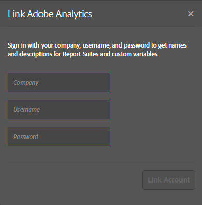
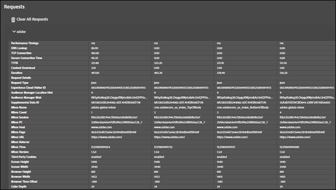

# Lösningsflikar{#solution-tabs}

Klicka på lösningsflikarna för att se resultaten för specifika Adobe Experience Cloud-lösningar.

## Analyser {#section-f71dfcc22bb44c86bec328491606a482}

Fliken Analytics innehåller information om er [Analytics](https://docs.adobe.com/content/help/en/analytics/landing/home.html) -implementering.

**Träffar**

Som standard komprimeras alla serveranrop som görs till samma rapportserie.

**Ladda ned:** Ladda ned information om alla rapportsviter som visas som ett Excel-kalkylblad.

**Rensa alla begäranden:** Ta bort alla begäranden som visas från Analytics-vyn. När du har tagit bort begäranden visas nya begäranden när de inträffar.

Klicka på rapportsvitens ID för att utöka vyn:

På den här skärmen visas alla begäranden sedan felsökningen öppnades eller förfrågningarna rensades. Standardparametrar mappas automatiskt till egna namn. [Variablerna Prop och eVar](https://docs.adobe.com/content/help/en/analytics/implementation/vars/page-vars/evar.html) kan mappas till egna egna namn (till exempel kan &quot;prop1&quot; visas som &quot;användartyp&quot;) om du autentiserar med funktionen &quot;Länkanalys&quot; (se nedan). Förfrågningar visas i sekvens från vänster till höger.

**Ladda ned:** Spara alla begäranden som gjorts i rapportsviten som ett Excel-kalkylblad.

**Rensa begäranden:** Rensa alla begäranden som gjorts i den här rapportsviten. Nya begäranden visas när de inträffar.

**Länkade konton (äldre)**

Klicka **[!UICONTROL Link Account]** och ange sedan den begärda informationen för att länka ett Analytics-konto till Felsökning.

>[!NOTE]
>
>Den här funktionen stöds för närvarande bara för inloggningsuppgifter för äldre Analytics-användare.

**Hämta efterbearbetade träffar**

Aktivera alternativet Hämta efterbearbetade träffar om du vill se värdena för analysträffar när bearbetningsreglerna har körts. Du måste vara inloggad på Adobe Experience Cloud för att den här funktionen ska fungera.

När det här alternativet är aktiverat läggs en felsökningsparameter till i dina Analytics-begäranden. Träffar bearbetas som andra träffar. Felsökaren avsöker Analytics-felsöknings-API:t för att hämta regelvärden för efterbearbetning för alla träffar som har ett ursprungligt Hit-ID. Efterbearbetade träffar har en lila bakgrund och visas bredvid den ursprungliga träffen.

För de flesta Analytics-implementeringar är informationen för efterbearbetningsreglerna tillgänglig inom några minuter. Analyserna för Target-implementering (A4T) tar betydligt längre tid.

## Mål {#section-988873ba5ede4317953193bd7ac5474c}

Använd fliken Mål för att visa [Target](https://docs.adobe.com/content/help/en/target/using/target-home.html) -begäranden eller [Mbox Trace](https://docs.adobe.com/content/help/en/target/using/activities/troubleshoot-activities/content-trouble.html) -svarsinformation.

Klicka **[!UICONTROL Requests]** och expandera sedan miljön för att visa information om Target.

Klicka **[!UICONTROL Clear All Requests]** för att ta bort de begäranden som visas. Fler begäranden visas när de görs.

Du kan också använda målfiltret för att [aktivera MBox-spårning för målfelsökning](https://docs.adobe.com/content/help/en/target/using/activities/troubleshoot-activities/content-trouble.html).

Du måste ha en öppen Chrome-flik som autentiseras i Experience Cloud för att aktivera Mbox Trace. När det är aktiverat visas ditt Adobe ID-användarnamn. Expandera ditt användarnamn för att visa de målklientkoder som är kopplade till de Experience Cloud-organisationer som du har åtkomst till. Klicka på den klientkod som du vill aktivera Mbox Trace för och bekräfta att den gröna bockmarkeringen visas. Alla Target-begäranden med information om Mbox Trace visas nu grupperade efter klientkod. Utforska informationen om Mbox Trace genom att expandera begäran så att flikarna visas:

* [Aktiviteter](https://docs.adobe.com/content/help/en/target/using/activities/activities.html) På fliken Aktiviteter visas alla aktiviteter som är associerade med namnet på målbegäran, oavsett om du är kvalificerad för aktiviteten eller inte. &quot;Matchade aktiviteter&quot; är de aktiviteter som du är kvalificerad för och vars erbjudanden levererades som svar. Du kan expandera aktivitetsnamnet för att bekräfta den upplevelse du är på och vilka målgrupper och målgruppsvillkor som kvalificerar dig för aktiviteten. &quot;Utvärderade aktiviteter&quot; är alla aktiviteter som utvärderas, oavsett om du är kvalificerad eller inte. Om du vill felsöka varför du inte kvalificerar dig för en aktivitet som är &quot;Utvärderad&quot; men inte &quot;Matchad&quot;, expanderar du aktivitetsnamnet och läser avsnittet &quot;Omatchade målgrupper&quot;.

* Begäran

   Fliken Begäran i [Mbox Trace](https://docs.adobe.com/content/help/en/target/using/activities/troubleshoot-activities/content-trouble.html) liknar fliken för huvudbegäran. Du kan visa alla parametrar som skickats av Target-begäran, förutom begäranderubrikerna.
* Profil

   Expandera delen Ögonblicksbild av profil för att visa [profilinformation](https://docs.adobe.com/content/help/en/target/using/audiences/visitor-profiles/variables-profiles-parameters-methods.html) som lagrats om dig som besökare i databasen för målprofiler. Alla profiler i lådan och skripten visas här, liksom vissa systemprofiler. I statuskolumnen visas vilka profiler som har ändrats inom den här begärans omfång, samt deras värden före och efter att begäran skickades till profilsystemet.
* Audience Manager

   Avsnitten&quot;segmentIds&quot; och&quot;cachedSegmentIds&quot; på fliken Audience Manager visar ID:n för [målgrupper](https://docs.adobe.com/content/help/en/target/using/audiences/target.html) som delas från Experience Cloud till Target och som du har kvalificerat dig för. Dessa kan vara målgrupper som skapats i Audience Manager, Analytics eller Audience Builder i People Core Service. Dessa ID:n kan slås upp i användargränssnittet för Audience Manager för att hitta målgruppens namn.

I följande video visas den allmänna Target-funktionen:

>[!VIDEO](https://video.tv.adobe.com/v/23115t2/)

I följande video visas Mbox Trace:

>[!VIDEO](https://video.tv.adobe.com/v/23113t2/)

## Audience Manager {#section-1d4484f8b46f457f859ba88039a9a585}

Använd fliken [Audience Manager](https://docs.adobe.com/content/help/en/audience-manager/user-guide/aam-home.html) för att visa information om [händelser](https://docs.adobe.com/content/help/en/audience-manager/user-guide/api-and-sdk-code/dcs/dcs-event-calls/dcs-event-calls.html). Klicka på organisationen för att expandera den och visa informationen.

Klicka **[!UICONTROL Clear All Events]** för att återställa den visade informationen. Nya händelser visas när de inträffar.

**ID-synkronisering**

ID-synkronisering är det första steget i den inkommande, asynkrona dataöverföringsprocessen. I det här steget jämför Audience Manager och leverantören ID:n för sina respektive webbplatsbesökare.

Mer information finns i [ID-synkronisering för inkommande dataöverföringar](https://docs.adobe.com/content/help/en/audience-manager/user-guide/implementation-integration-guides/sending-audience-data/batch-data-transfer-process/id-sync-http.html) i produktdokumentationen för Audience Manager.

## Advertising Cloud {#section-ee80a9c509f2462c89c1e5bd8d05d7c8}

Använd fliken Advertising Cloud för att visa förfrågningar från Advertising Cloud.

Klicka **[!UICONTROL Requests]** och expandera sedan miljön för att visa information om Advertising Cloud.

Klicka **[!UICONTROL Clear All Requests]** för att ta bort de begäranden som visas. Fler begäranden visas när de görs.

## Experience Cloud ID-tjänst {#section-a96c32f8e63a4991abb296f6e8ea01cf}

Använd fliken Experience Cloud ID Service för att visa begäranden om [Experience Cloud ID-tjänst](https://docs.adobe.com/content/help/en/id-service/using/home.html) .

Klicka **[!UICONTROL Requests]** och expandera sedan miljön för att visa information om Experience Cloud ID-tjänsten.

Klicka **[!UICONTROL Clear All Requests]** för att ta bort de begäranden som visas. Fler begäranden visas när de görs.
