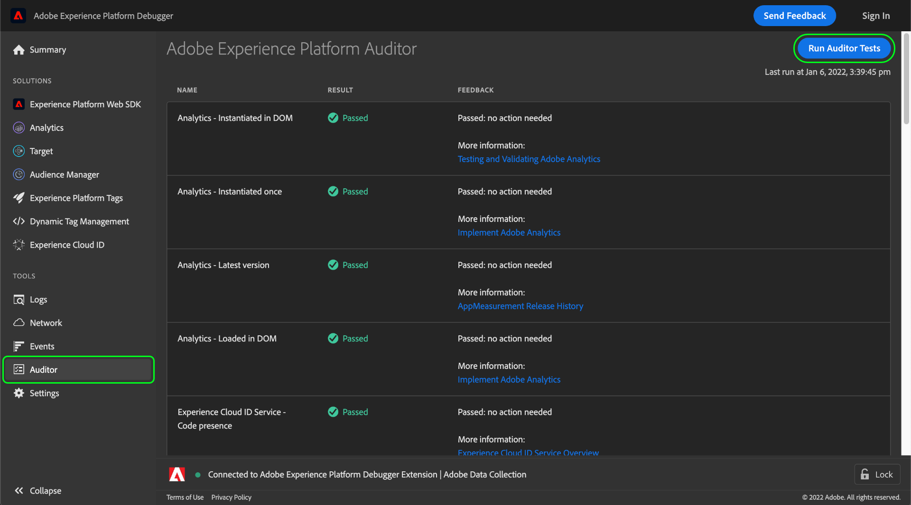

# Revisor

>[!IMPORTANT]
>
>Adobe Experience Platform Debugger är för närvarande i betaversion. Dokumentationen och funktionaliteten kan komma att ändras.

I Adobe Experience Platform Debugger kan du använda **[!UICONTROL Auditor]** för att köra en serie granskningstester på sidan.

Så här använder du den här funktionen:

1. Välj **[!UICONTROL Auditor]** i den vänstra navigeringen.
1. Välj **[!UICONTROL Run Auditor Tests]**. När testerna är klara visas resultaten nedan.

I resultatlistan visas testet och dess resultat, och förslag på hur du kan lösa eventuella problem.
