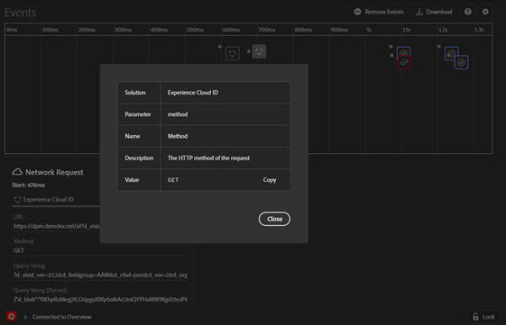

# Händelser{#events}

>[!IMPORTANT]
>
>Adobe Experience Cloud Debugger 2.0 är en betaversion. Dokumentationen och funktionaliteten kan komma att ändras.

På skärmen Händelser visas en grafisk vy över händelser som inträffar, som visas på en tidslinje.

För varje händelse visas en ikon för den tillämpliga Experience Cloud-lösningen på tidslinjen. Ikoner visar även ändringar i datalagret (om det är aktiverat). Håll pekaren över en ikon om du vill se en sammanfattning av händelsen. Klicka på händelsen för mer information. Du kan Skift-klicka eller Ctrl-klicka om du vill visa flera händelser.

Klicka på en detalj om du vill ha mer information.

## Spåra ändringar i datalager

Så här aktiverar du spårning av datalagerändringar på tidslinjen:

1. Klicka på ikonen Kugghjulet längst upp till höger.
1. Ange namnet på datalagret.

   

1. Klicka på **[!UICONTROL Save]**.

Information om datalagrets ändringar visar allt som har tagits bort eller lagts till. Du kan klicka på **{}** om du vill se mer detaljerad ut i datalagret.

## Hämta händelseinformation

Klicka **[!UICONTROL Download]** för att ladda ned en Excel-fil med information om dina sidsamtal.