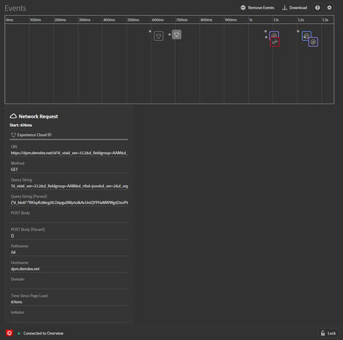

# Fliken Händelser

The **Händelser** -fliken innehåller en grafisk vy över händelser som inträffar, som visas på en tidslinje.

För varje händelse visas en ikon för den tillämpliga lösningen på tidslinjen. Ikoner visar även ändringar i datalagret (om det är aktiverat). Håll pekaren över en ikon om du vill se en sammanfattning av händelsen. Välj på evenemanget om du vill ha mer information. Du kan Skift-markera eller Ctrl-markera om du vill visa flera händelser.

Välj en detalj om du vill ha mer information.

## Spåra ändringar i datalager

Så här aktiverar du spårning av datalagerändringar på tidslinjen:

1. Välj växlingsikonen längst upp till höger.
1. Ange namnet på datalagret.

   

1. Välj **[!UICONTROL Save]**.

Information om datalagrets ändringar visar allt som har tagits bort eller lagts till. Du kan välja **{}** för att fördjupa sig i datalagret.

## Hämta händelseinformation

Välj **[!UICONTROL Download]** om du vill hämta en Excel-fil med information om dina sidsamtal.
