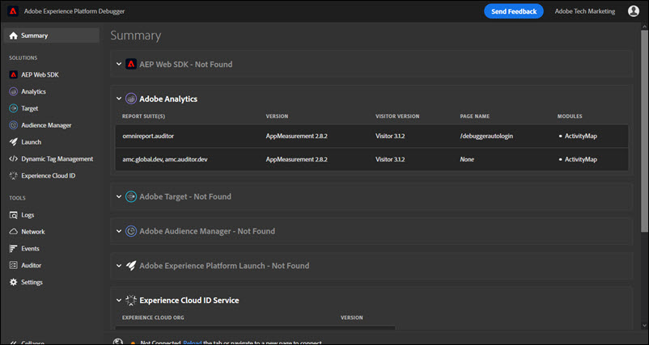

# Fliken Sammanfattning

Om du vill köra Adobe Experience Platform Debugger öppnar du den sida du vill granska i webbläsaren och väljer sedan ikonen () i webbläsarfältet. Tillägget öppnas på **Sammanfattning** -fliken.

På den här skärmen visas information om varje Adobe Experience Cloud-lösning. Den information som visas varierar beroende på lösning, men innehåller vanligtvis information som lösningsbiblioteket och version (till exempel&quot;AppMeasurement v2.9&quot;) och kontoidentifierare (till exempel Analytics-rapportens programpaket-ID, målklientkoden, Audience Manager partner-ID osv.)

## Information som visas i felsökningsprogrammet för Experience Platform

Felsökaren i Experience Platform visar följande information för varje lösning:

**Adobe Analytics**

<table id="table_BEB9CC58E59D4D86BC895A8A51D84A2C"> 
 <tbody> 
  <tr> 
   <td colname="col1"> 
Rapportsvit(er) 
 </td> 
   <td colname="col2"> 
A <a href="https://experiencecloud.adobe.com/resources/help/en_US/reference/report_suites_admin.html" format="html" scope="external"> rapportsvit</a> definierar den fullständiga, oberoende rapporteringen på en vald webbplats, en uppsättning webbplatser eller en delmängd av webbsidor 
 </td> 
  </tr> 
  <tr> 
   <td colname="col1"> 
Version 
 </td> 
   <td colname="col2"> 
The <a href="https://experiencecloud.adobe.com/resources/help/en_US/sc/implement/appmeasure_mjs.html" format="html" scope="external"> AppMeasurement</a> version definierad för sidan 
 </td> 
  </tr> 
  <tr> 
   <td colname="col1"> 
Besökarversion 
 </td> 
   <td colname="col2"> 
Versionen av <a href="https://experiencecloud.adobe.com/resources/help/en_US/sc/implement/visid_analytics.html" format="html" scope="external"> besökar-ID</a> bibliotek. 
 </td> 
  </tr> 
  <tr> 
   <td colname="col1"> 
Sidnamn 
 </td> 
   <td colname="col2"> 
The <a href="https://experiencecloud.adobe.com/resources/help/en_US/sc/implement/pageName.html" format="html" scope="external"> pageName</a> variabel som skickas till Analytics som innehåller ett användarvänligt namn för webbplatsen. 
 </td> 
  </tr> 
  <tr> 
   <td colname="col1"> 
Moduler 
 </td> 
   <td colname="col2"> 
Modulerna som läses in av Adobe Analytics 
 </td> 
  </tr> 
 </tbody> 
</table>

**Audience Manager**

<table id="table_784AEABADBDA4D14BB9A7A9CB9EF07C3"> 
 <tbody> 
  <tr> 
   <td colname="col1"> 
Partner 
 </td> 
   <td colname="col2"> 
The <a href="https://experiencecloud.adobe.com/resources/help/en_US/aam/r_dil_get_partner.html" format="html" scope="external"> partnernamn</a> för instansen DIL 
 </td> 
  </tr> 
  <tr> 
   <td colname="col1"> 
Version 
 </td> 
   <td colname="col2"> 
The<a href="https://experiencecloud.adobe.com/resources/help/en_US/aam/r_api_return_versions_dil.html" format="html" scope="external"> versionsnummer</a> för instansen DIL 
 </td> 
  </tr> 
  <tr> 
   <td colname="col1"> 
UUID 
 </td> 
   <td colname="col2"> 
The <a href="https://experiencecloud.adobe.com/resources/help/en_US/aam/ids-in-aam.html" format="html" scope="external"> Unikt användar-ID</a> associerad med instansen DIL 
 </td> 
  </tr> 
 </tbody> 
</table>

**Adobe Experience Platform-taggar**

<table id="table_E9574975444A407887E26514D1BB1601"> 
 <tbody> 
  <tr> 
   <td colname="col1"> 
Namn 
 </td> 
   <td colname="col2"> 
Namnet på taggen <a href="https://experienceleague.adobe.com/docs/experience-platform/tags/admin/companies-and-properties.html" format="https" scope="external"> property</a> 
 </td> 
  </tr> 
  <tr> 
   <td colname="col1"> 
Version 
 </td> 
   <td colname="col2"> 
Turbinversionen</a> 
 </td> 
  </tr> 
  <tr> 
   <td colname="col1"> 
Skapad den 
 </td> 
   <td colname="col2"> 
Taggen <a href="https://experienceleague.adobe.com/docs/experience-platform/tags/publish/libraries.html" format="https" scope="external"> bibliotek</a> byggdatum 
 </td> 
  </tr> 
  <tr> 
   <td colname="col1"> 
Miljö 
 </td> 
   <td colname="col2"> 
The <a href="https://experienceleague.adobe.com/docs/experience-platform/tags/publish/environments/environments.html" format="https" scope="external"> miljö</a> som används av taggbiblioteket 
 </td> 
  </tr> 
  <tr> 
   <td colname="col1"> 
Tillägg 
 </td> 
   <td colname="col2"> 
De tillägg som används på sidan 
 </td> 
  </tr> 
 </tbody> 
</table>

**Webb-SDK för Adobe Experience Platform**

<table id="table_DC76D63FA6EF4891906B9E1D3E4A8A6C"> 
 <tbody> 
  <tr> 
   <td colname="col1"> 
Biblioteksversion 
 </td> 
   <td colname="col2"> 
Antalet Adobe Experience Platform Web SDK <a href="https://experienceleague.adobe.com/docs/experience-platform/edge/extension/web-sdk-ext-release-notes.html" format="html" scope="external">biblioteksversion</a> 
 </td> 
  </tr> 
  <tr> 
   <td colname="col1"> 
Namnutrymme
 </td> 
   <td colname="col2"> 
Namnet som identifieras i tillägget
 </td> 
  </tr> 
  <tr> 
   <td colname="col1"> 
Egenskaps-ID 
 </td> 
   <td colname="col2"> 
Namnet på taggegenskapen som anges i tillägget 
 </td> 
  </tr> 
  <tr> 
   <td colname="col1"> 
Edge Domain 
 </td> 
   <td colname="col2"> 
Domänen som Adobe Experience Platform-tillägget skickar och tar emot data från 
 </td> 
  </tr> 
  <tr> 
   <td colname="col1"> 
IMS-organisations-ID 
 </td> 
   <td colname="col2"> 
Organisationen som du vill att data skickas till på Adobe, enligt vad som anges i tillägget 
 </td> 
  </tr> 
  <tr> 
   <td colname="col1"> 
Loggning aktiverad 
 </td> 
   <td colname="col2"> 
Anger om loggning har aktiverats för den här egenskapen
 </td> 
  </tr> 
 </tbody> 
</table>

**Adobe Experience Cloud ID-tjänst**

<table id="table_274CFCEFA8F34D16BB546B4669EC0209"> 
 <tbody> 
  <tr> 
   <td colname="col1"> 
Experience Cloud organisation-ID 
 </td> 
   <td colname="col2"> 
Dina <a href="https://experiencecloud.adobe.com/resources/help/en_US/mcvid/" format="https" scope="external"> Organisations-ID</a> 
 </td> 
  </tr> 
  <tr> 
   <td colname="col1"> 
Version 
 </td> 
   <td colname="col2"> 
Versionen av<a href="https://experiencecloud.adobe.com/resources/help/en_US/sc/implement/visid_analytics.html" format="html" scope="external"> besökar-ID</a> bibliotek 
 </td> 
  </tr> 
 </tbody> 
</table>

**Adobe Target**

<table id="table_D30E0CD20FB04E41862B22655136E043"> 
 <tbody> 
  <tr> 
   <td colname="col1"> 
Klientkod 
 </td> 
   <td colname="col2"> 
Ditt mål <a href="https://experienceleague.adobe.com/docs/target/using/implement-target/client-side/at-js-implementation/deploy-at-js/implementing-target-without-a-tag-manager.html" format="html" scope="external"> Klientkod </a> 
 </td> 
  </tr> 
  <tr> 
   <td colname="col1"> 
Version 
 </td> 
   <td colname="col2"> 
Din nuvarande <a href="https://experienceleague.adobe.com/docs/target/using/implement-target/client-side/at-js-implementation/target-atjs-versions.html" format="html" scope="external"> at.js</a> eller mbox.js version 
 </td> 
  </tr> 
  <tr> 
   <td colname="col1"> 
Namn på global begäran 
 </td> 
   <td colname="col2"> 
The<a href="https://experienceleague.adobe.com/docs/target/using/implement-target/client-side/global-mbox/understanding-global-mbox.html" format="html" scope="external"> global mbox</a> refererar till det enskilda serveranropet som görs högst upp på varje webbsida i Target-implementeringen 
 </td> 
  </tr> 
  <tr> 
   <td colname="col1"> 
Sidinläsningshändelse 
 </td> 
   <td colname="col2"> 
Typ av <a href="https://experienceleague.adobe.com/docs/experience-platform/tags/extensions/adobe/target/overview.html" format="html" scope="external">event</a> som utlöses när sidan läses in 
 </td> 
  </tr> 
  <tr> 
   <td colname="col1"> 
Namn på begäran 
 </td> 
   <td colname="col2"> 
Namnet på en begäran runt en <a href="https://experienceleague.adobe.com/docs/target/using/implement-target/client-side/global-mbox/understanding-global-mbox.html" format="html" scope="external"> plats</a> på sidan. Endast tillgängligt utan autentisering om du implementerar händelseavlyssnaren för felsökning i koden eller tagghanteraren och aktiverar den nödvändiga <a href="https://experienceleague.adobe.com/docs/target/using/administer/response-tokens.html" format="html" scope="external"> svarstoken</a> i målgränssnittet. 
 </td> 
  </tr> 
  <tr> 
   <td colname="col1"> 
Aktivitetsnamn 
 </td> 
   <td colname="col2"> 
Namnet på målet <a href="https://experienceleague.adobe.com/docs/target/using/activities/activities.html" format="html" scope="external"> kampanj eller aktivitet</a>. Endast tillgängligt utan autentisering om du implementerar händelseavlyssnaren för felsökning i koden eller tagghanteraren och aktiverar den nödvändiga <a href="https://experienceleague.adobe.com/docs/target/using/administer/response-tokens.html" format="html" scope="external"> svarstoken</a> i målgränssnittet. 
 </td> 
  </tr> 
  <tr> 
   <td colname="col1"> 
Aktivitets-ID 
 </td> 
   <td colname="col2"> 
ID för målaktiviteten. Endast tillgängligt utan autentisering om du implementerar händelseavlyssnaren för felsökning i koden eller tagghanteraren och aktiverar den nödvändiga <a href="https://experienceleague.adobe.com/docs/target/using/administer/response-tokens.html" format="html" scope="external"> svarstoken</a> i målgränssnittet. 
 </td> 
  </tr> 
  <tr> 
   <td colname="col1"> 
Experience Name 
 </td> 
   <td colname="col2"> 
Namnet på målet <a href="https://experienceleague.adobe.com/docs/target/using/experiences/experiences.html" format="html" scope="external"> upplevelse</a>. Endast tillgängligt utan autentisering om du implementerar händelseavlyssnaren för felsökning i koden eller tagghanteraren och aktiverar den nödvändiga <a href="https://experienceleague.adobe.com/docs/target/using/administer/response-tokens.html" format="html" scope="external"> svarstoken</a> i målgränssnittet. 
 </td> 
  </tr> 
  <tr> 
   <td colname="col1"> 
Experience ID 
 </td> 
   <td colname="col2"> 
ID för Target-upplevelsen. Endast tillgängligt utan autentisering om du implementerar händelseavlyssnaren för felsökning i koden eller tagghanteraren och aktiverar den nödvändiga <a href="https://experienceleague.adobe.com/docs/target/using/administer/response-tokens.html" format="html" scope="external"> svarstoken</a> i målgränssnittet. 
 </td> 
  </tr> 
  <tr> 
   <td colname="col1"> 
Namn på erbjudande
 </td> 
   <td colname="col2"> 
Namnet på målet <a href="https://experienceleague.adobe.com/docs/target/using/experiences/offers/manage-content.html" format="html" scope="external"> erbjudande</a>. Endast tillgängligt utan autentisering om du implementerar händelseavlyssnaren för felsökning i koden eller tagghanteraren och aktiverar den nödvändiga <a href="https://experienceleague.adobe.com/docs/target/using/administer/response-tokens.html" format="html" scope="external"> svarstoken</a> i målgränssnittet. 
 </td> 
  </tr> 
  <tr> 
   <td colname="col1"> 
Erbjudande-ID 
 </td> 
   <td colname="col2"> 
ID:t för Target-erbjudandet. Endast tillgängligt utan autentisering om du implementerar händelseavlyssnaren för felsökning i koden eller tagghanteraren och aktiverar den nödvändiga <a href="https://experienceleague.adobe.com/docs/target/using/administer/response-tokens.html" format="html" scope="external"> svarstoken</a> i målgränssnittet. 
 </td> 
  </tr> 
 </tbody> 
</table>
